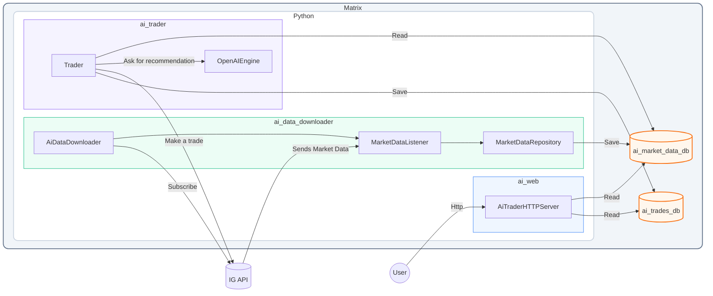

# aitrade
An application that uses AI to run tradings for you

## Architecture

### ai_data_downloader

This module is responsible for downloading and storing market data from the IG API.

    # IG account information. Mandatory.
    LIVE_IG_SERVICE_USERNAME
    LIVE_IG_SERVICE_PASSWORD
    LIVE_IG_SERVICE_API_KEY
    LIVE_IG_SERVICE_ACC_TYPE
    LIVE_IG_SERVICE_ACC_NUMBER
    # Comma separated list of epics to subscribe to. Mandatory.
    DOWNLOAD_EPICS
    # Folder where to to save the database. Optional, defaults to ../../data
    DATA_DIR

### ai_trader

This module is responsible for executing trades based on the downloaded market data and the trading strategy implemented in the `trading_engine` module.

### ai_web

This module is responsible for providing a web interface to view the trading results and market data.

## Development

Install system packages:

    sudo apt update
    sudo apt install python3 python3-pip python3-venv python-is-python3 pipx

Install the requirements:

    python -m venv .venv
    source .venv/bin/activate
    pip install .

Setup IG and Gemini API keys as described in https://www.ig.com/uk/myig/settings/api-keys

In the root folder, create a `.env` file and add:

    ### Trading Platform (ai_data_downloader uses always live, ai_trader can use demo or live: right now hardcoded to demo)
    DEMO_IG_SERVICE_API_KEY=<key>
    DEMO_IG_SERVICE_USERNAME=<username>
    DEMO_IG_SERVICE_PASSWORD=<password>
    DEMO_IG_SERVICE_ACC_TYPE=<DEMO or LIVE>
    DEMO_IG_SERVICE_ACC_NUMBER=<acc-number>
    
    LIVE_IG_SERVICE_API_KEY=f54741ddec5e711ec6fc121a3aa3078830410dc4
    LIVE_IG_SERVICE_USERNAME=antonioalonzi85
    LIVE_IG_SERVICE_PASSWORD=4n9Wqxdt.WgsYKH
    LIVE_IG_SERVICE_ACC_TYPE=LIVE
    LIVE_IG_SERVICE_ACC_NUMBER=APQVK

    
    ### Trading Engine
    GEMINI_API_KEY=<API_KEY>

## Run

To execute the application from the project root with correct module resolution paths

### ai_data_downloader

    PYTHONPATH=src python src/ai_data_downloader/app.py

### ai_trader

    PYTHONPATH=src python src/ai_trader/app.py

### ai_web

    PYTHONPATH=src python src/ai_web/app.py

## Useful commands

### Command to test AI

    time curl http://server:9402/api/chat -H "Content-Type: application/json"   -d '{"model": "qwen2.5-coder:32b", "stream": false, "options": {"num_ctx": 16384}, "messages": [{"role": "user", "content": "Hello, how much is 4 * 5?"}]}'

### Update SQLite in prod

    docker exec -it ai_data_downloader python3 -c "import sqlite3; print(sqlite3.connect('/app/data/ai_trades.db').execute('SELECT * FROM TRADES;').fetchall())"

### Copy Data Locally

    scp server:/home/nio/docker-stack/aitrade/data/* ./data/
